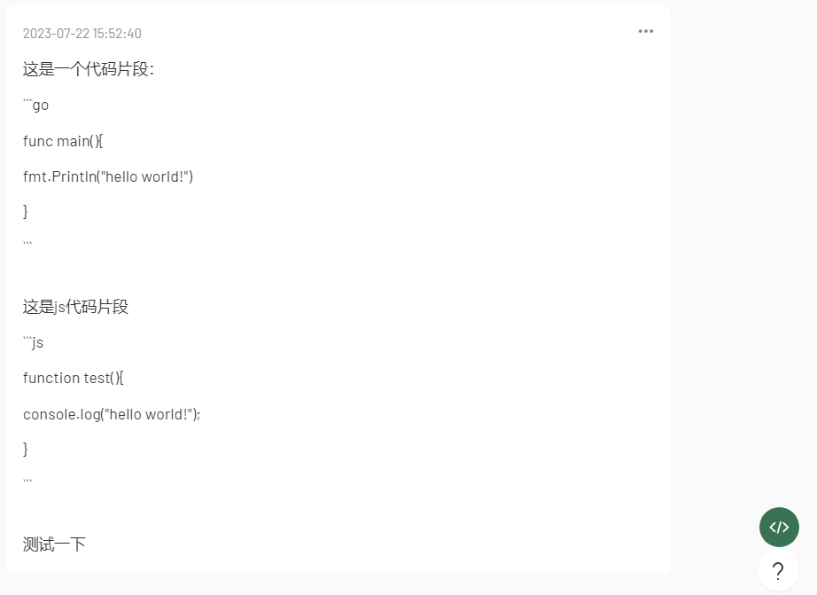
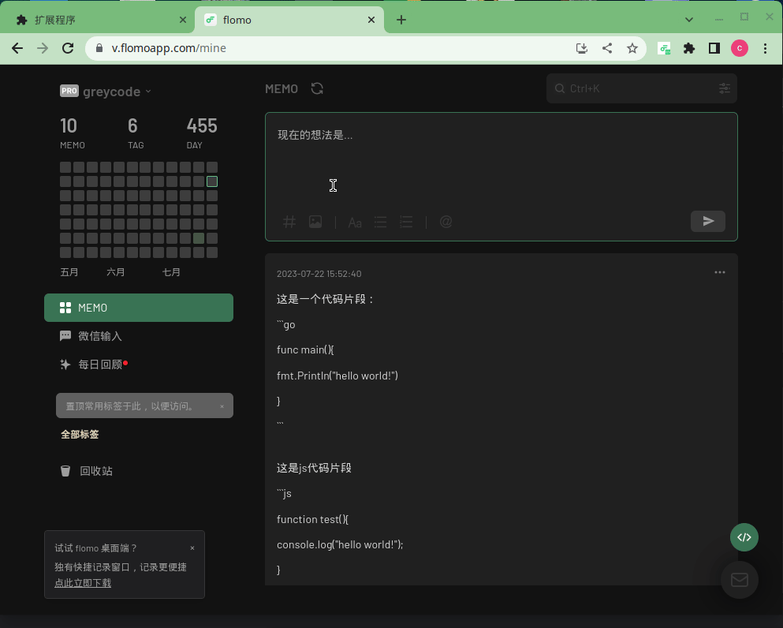

# Flomo Code

Flomo Code 是一款 Chrome 扩展程序，为您的 Flomo 笔记提供代码语法高亮功能。

## 安装

您可以从 [Release](https://github.com/greycodee/flomo-code/releases/) 下载源码压缩包，然后解压文件。在 **Chrome 扩展程序**页面打开右上角的**开发者模式**，选择**加载已解压的扩展程序**，选择解压的文件路径，就可加载flomo-code
## 使用

要使用 Flomo Code，只需在 Flomo 笔记中添加 Markdown 代码块，点击 flomo 页面右下角`绿色按钮`，即可突出显示语法。

### before

### after

## 更换代码主题

可以在插件栏点击进行更换代码主题

## 贡献

欢迎贡献！如果您发现错误或有功能请求，请在 [GitHub 存储库](https://github.com/greycodee/flomo-code) 上打开 Issue。

## 许可证

Flomo Code 在 [MIT 许可证](https://opensource.org/licenses/MIT) 下获得许可。